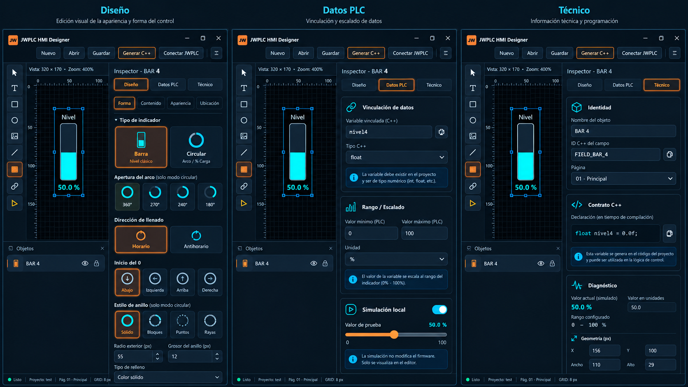

# JWPLC HMI Designer — Rediseño del inspector BAR

**Especificación UI/UX para implementación · Propuesta 2: «Visual e intuitivo»**  
**Proyecto:** JWPLC HMI Designer (JWPLC Basic)  
**Referencia de trabajo:** interfaz actual «Alpha11» y mockup seleccionado por el responsable del proyecto  
**Estado:** propuesta de diseño aprobada visualmente; **implementación y compatibilidad técnica pendientes de verificación**  
**Alcance:** inspector de objetos `BAR` en variantes **Barra** y **Circular**. No es una solicitud para rediseñar todo el editor.



> **Instrucción al practicante y a su IA:** tomar la imagen como referencia de **lenguaje visual, densidad, jerarquía y composición**, no como una especificación funcional exacta. En ella aparecen controles exclusivos de la variante Circular mientras «Barra» figura seleccionada: **esa inconsistencia NO debe replicarse**. Mostrar únicamente las propiedades que correspondan a la variante activa. Antes de desarrollar, revisar los controles, nombres de propiedades, estado serializado y generación C++ existentes.

---

## 1. Objetivo del rediseño

Sustituir el **scroll vertical único y excesivamente largo** del inspector de nivel por una organización contextual fácil de aprender y rápida de usar. Mantener la precisión del diseño sobre pantalla ST7789 de **320 × 170 px**, así como los mecanismos de selección y edición existentes.

**Resultados esperados:**

1. Mostrar tres pestañas principales: **Diseño**, **Datos PLC**, **Técnico**.
2. En **Diseño**, agregar cuatro subpestañas: **Forma**, **Contenido**, **Apariencia** y **Ubicación**.
3. Conservar y extender los **selectores visuales con iconos y miniaturas** que permiten anticipar el efecto de cada cambio.
4. Presentar la **simulación local únicamente dentro de Datos PLC** (el lienzo puede seguir reflejando el valor simulado; no se coloca otro slider permanente en Diseño o Técnico).
5. Reducir desplazamiento vertical por pantalla mediante controles visuales compactos, columnas y agrupaciones coherentes, **sin esconder funciones importantes arbitrariamente**.
6. Preservar el proyecto guardado, el contrato de las variables C++, la generación de código, el comportamiento del lienzo y las funciones existentes para los demás tipos de objetos.

### Fuera de alcance por defecto

- Rediseño global de la barra superior, del explorador de objetos, de la barra de herramientas de dibujo o de la vista previa. La imagen usa una distribución referencial que **no obliga** a mover estas regiones.
- Introducción de tipos de objeto nuevos, un motor gráfico nuevo, nuevas fuentes tipográficas o nuevas funcionalidades del firmware.
- Cambios en el formato de proyectos, esquemas de código generado y API pública, salvo aprobación específica respaldada por pruebas.
- Implementación automática de **escalado PLC configurable** si todavía no existe. En el mockup es una **propuesta funcional** que requiere confirmación técnica (ver §5).

---

## 2. Arquitectura general del inspector

### 2.1 Cabecera persistente

Propuesta, de arriba a abajo:

```text
┌──────────────────────────────────────────────┐
│ Inspector — BAR 4              [Duplicar][×] │
├──────────────────────────────────────────────┤
│ [   Diseño   ] [ Datos PLC ] [ Técnico ]     │
├──────────────────────────────────────────────┤
│  Contenido de la pestaña activa              │
└──────────────────────────────────────────────┘
```

- La cabecera identifica **el objeto seleccionado** (`BAR 4`) sin consumir otra fila de edición de nombre en todas las pestañas.
- El cambio de pestaña **no cambia la selección**, no reubica el objeto y no debe perder modificaciones.
- «Duplicar» y «Eliminar» se mantienen en las ubicaciones ya existentes si están implementadas; la imagen no justifica crear acciones duplicadas.
- **Activo:** borde y texto naranja. **Inactivo:** azul oscuro y texto gris claro. Evitar colorear toda la pestaña de cian; reservar ese color para representación de señales o elementos gráficos.
- Mantener fija la cabecera del inspector mientras **solo el contenido inferior** se desplaza verticalmente. Evitar scroll anidado.
- Preservar la última pestaña utilizada al cambiar entre objetos `BAR` si es técnicamente sencillo; cuando cambia el tipo de objeto, elegir una pestaña válida sin errores.

### 2.2 Arquitectura de navegación

```text
INSPECTOR BAR
│
├── DISEÑO
│   ├── Forma
│   ├── Contenido
│   ├── Apariencia
│   └── Ubicación
│
├── DATOS PLC
│   ├── Vinculación de datos
│   ├── Rango / Escalado (condicionado a soporte real)
│   └── Simulación local
│
└── TÉCNICO
    ├── Identidad
    ├── Contrato C++
    ├── Diagnóstico de geometría
    └── Acciones avanzadas
```

**Principio central:** una propiedad tiene **un único lugar principal de edición**. Puede aparecer en la cabecera o el diagnóstico como *resumen de solo lectura*, pero no se debe duplicar su edición en múltiples pestañas.

---

## 3. Pestaña principal: Diseño

**Propósito:** modificar cómo se ve el indicador y dónde está situado en la pantalla física, sin exponer detalles C++ que distraigan del diseño.

### 3.1 Subnavegación de Diseño

Fila horizontal inmediatamente debajo de «Diseño»:

`[ Forma ]  [ Contenido ]  [ Apariencia ]  [ Ubicación ]`

- Cuatro opciones siempre visibles, con la activa resaltada en naranja.
- No utilizar acordeones largos para reemplazar las subpestañas.
- Cada subpestaña tiene su propio contenido y desplazamiento limitado.
- Acordeones **internos** son aceptables para opciones secundarias, pero no deben ocultar el contenido principal por defecto.

### 3.2 Diseño → Forma

**Orden exacto de grupos:**

**A. Tipo de indicador**

Dos tarjetas visuales, con el mismo lenguaje del mockup:

- **Barra**: icono de nivel rectangular con relleno cian + texto «Barra» + subtítulo «Nivel clásico».
- **Circular**: icono de anillo progresivo + texto «Circular» + subtítulo «Arco / % carga».

Reglas:

- Mostrar borde naranja, ligero fondo cálido y texto destacado en la tarjeta elegida.
- Las tarjetas deben ser clicables en toda su superficie; navegación por teclado también.
- El lienzo y el inspector se actualizan conjuntamente, usando la **misma fuente de estado** del objeto.
- No reinicializar silenciosamente otros campos al cambiar de variante; respetar las reglas de persistencia actuales y documentar lo que se conserve.

**B. Parámetros para la variante Barra** *(visibles solo cuando Barra está activa)*

| Orden | Control | Representación recomendada |
|---|---|---|
| 1 | Orientación | Dos botones visuales: **Horizontal / Vertical**, con pequeños dibujos |
| 2 | Modo de ancho | Selector del modo que ya soporte la aplicación (p. ej., `FIJO`) |
| 3 | Longitud de barra (px) | Campo numérico con incremento/decremento |
| 4 | Grosor de barra (px) | Campo numérico con incremento/decremento |
| 5 | Tipo de relleno | Selector visual cuando existan pocos tipos; menú si hay muchos |

> La etiqueta, el porcentaje y sus tamaños no van aquí; van en **Contenido**. Los colores del relleno y de la pista no van aquí; van en **Apariencia**.

**C. Parámetros para la variante Circular** *(visibles solo cuando Circular está activa)*

| Orden | Control | Representación recomendada |
|---|---|---|
| 1 | Apertura del arco | Cuatro tarjetas con miniaturas reales: **360° / 270° / 240° / 180°** |
| 2 | Dirección de llenado | Dos tarjetas grandes: **Horario / Antihorario**, con flechas circulares |
| 3 | Inicio del cero | Cuatro botones visuales: **Arriba / Derecha / Abajo / Izquierda** |
| 4 | Estilo del anillo | Cuatro tarjetas: **Sólido / Bloques / Puntos / Rayas**, cada una con su trazo |
| 5 | Radio exterior (px) | Campo numérico con control de paso |
| 6 | Grosor del anillo (px) | Campo numérico con control de paso |
| 7 | Tipo de relleno | Control que reutilice los modos de relleno soportados |

Disposición:

- Apertura: **4 columnas** de tarjetas pequeñas con sus miniaturas de arco; no reemplazar la selección por un simple desplegable.
- Dirección: **2 columnas** con flechas grandes.
- Inicio del cero: **4 columnas** de iconos con etiquetas legibles; seguir el criterio existente para las coordenadas del arco.
- Estilo: **4 columnas** mostrando visualmente las diferencias entre sólido, bloques, puntos y rayas.
- Radio y grosor: **2 columnas**, con unidades `px` visibles en los campos.
- Tipo de relleno: una fila completa al final.

**Corrección necesaria respecto del mockup:** si la tarjeta **Barra** está activa, no mostrar «Apertura del arco», «Dirección del anillo», «Inicio del 0» ni «Estilo de anillo». Si la tarjeta **Circular** está activa, ocultar longitud/grosor de barra. Este comportamiento condicional es obligatorio.

### 3.3 Diseño → Contenido

Esta subpestaña reúne **todo el texto visible** asociado al objeto y su distribución.

| Orden | Sección | Campos / interacción |
|---|---|---|
| 1 | Etiqueta | Texto de «Etiqueta visible», interruptor «Mostrar etiqueta» |
| 2 | Unidad | Texto de unidad (p. ej. `%`, `°C`, `RPM` según soporte existente) |
| 3 | Alineación de la etiqueta | **Matriz visual 3 × 3**; una celda activa con resaltado naranja |
| 4 | Tipografía | Tamaño de etiqueta (1×, 2×, etc., según motor GFX y límites reales) |
| 5 | Lectura del indicador | Mostrar/ocultar porcentaje si la variante lo permite |
| 6 | Lectura central (Circular) | Modo de texto en el centro: porcentaje, valor u oculto, **solo si ya está soportado** |
| 7 | Texto central (Circular) | Tamaño y color *del texto*: el tamaño se edita aquí; el color en Apariencia |

Reglas de dependencia:

- Si «Mostrar etiqueta» está desactivado, ocultar o deshabilitar la alineación y tamaño **solo** de la etiqueta.
- Los controles que dependen de «mostrar porcentaje» se desactivan coherentemente.
- Los modos de texto del centro de Circular solo aparecen en Circular.
- La cuadrícula de alineación 3 × 3 debe seguir el mismo significado espacial y el mismo estilo ya usado en la aplicación.
- No permitir tamaños de letra que salgan de la pantalla sin advertencia o validación. No alterar silenciosamente la fuente/renderizado existente.

### 3.4 Diseño → Apariencia

Todo lo que sea **color, fondo, pista o borde** va aquí:

| Orden | Campo | Comportamiento |
|---|---|---|
| 1 | Color de relleno / progreso | Selector con muestra grande; usar RGB565 soportado |
| 2 | Color de pista vacía | Muestra + selector, relevante para Barra y Circular |
| 3 | Color de etiqueta | Muestra + selector; si la etiqueta está oculta puede deshabilitarse |
| 4 | Color de valor / porcentaje | Muestra + selector; respetar la variante y visibilidad del texto |
| 5 | Color de fondo | Paleta + opción transparente **solo cuando el motor lo permita** |
| 6 | Borde | Activar/desactivar o selector equivalente al comportamiento actual |

**Diseño del control de color:** una única fila compacta con nombre, pequeña muestra RGB y valor hexadecimal cuando proceda. El detalle avanzado (paleta, componentes, HEX RGB565) se puede abrir en un popover; no dedicar dos filas altas a cada color si no es necesario. Sincronizar la muestra, el código hexadecimal y la vista del lienzo.

**Importante:** el **tema visual del editor** (CSS/Qt/UI) y los **colores RGB565 del dispositivo** son cosas distintas. Un selector puede usar acentos cian/naranja en el editor, pero el código `0x07FF` debe convertirse y visualizarse correctamente en el destino.

### 3.5 Diseño → Ubicación

Lugar único para posición y asignación del objeto a la página.

| Orden | Control | Notas |
|---|---|---|
| 1 | Página | Selector «01 - Principal», etc. |
| 2 | Coordenada X1 (px) | Campo numérico editable |
| 3 | Coordenada Y1 (px) | Campo numérico editable |
| 4 | Ancho × alto calculado | **Solo lectura**, basado en geometría actual |
| 5 | Región del valor | **Solo lectura**, si existe en el modelo actual |
| 6 | Ajustes/acciones de alineación | Solo si ya forman parte de la edición de objetos; no duplicar Snap global |

- Edición de coordenadas y arrastre en el lienzo deben actualizarse en ambas direcciones.
- Valores fuera de la pantalla física o límites incorrectos deben generar una indicación comprensible, no un fallo silencioso.
- «Rejilla», «Paso de grilla», «Ajuste magnético» y «Paso de Snap» pertenecen principalmente a la **configuración global del editor/lienzo**. Evitar repetir el panel completo dentro de cada BAR.
- Los datos internos como padding, gap y regiones calculadas tendrán su **detalle exhaustivo en Técnico**; en Ubicación bastan las medidas pertinentes al diseñador.

---

## 4. Pestaña principal: Datos PLC

**Propósito:** permitir asociar una variable y comprobar el comportamiento del indicador. **Es el único lugar donde aparece el control de simulación local.**

**Presentación:** tres tarjetas verticales claramente separadas, con icono cian en su encabezado y padding suficiente: «Vinculación de datos», «Rango / Escalado» y «Simulación local».

### 4.1 Vinculación de datos

**Orden:**

1. Campo **Variable vinculada (C++)**, por ejemplo `nivel4`.
2. Campo **Tipo C++**, por ejemplo `float` (usar tipos compatibles con la implementación real).
3. Ayuda contextual de una línea o tooltip acerca de los nombres válidos y la relación con el código generado.

**Comportamiento:**

- Validar nombres de identificador, colisiones, tipos compatibles y campos vacíos usando validaciones existentes o acordadas.
- No mostrar una declaración editable de C++ en esta pestaña; el contrato de código va en Técnico.
- Si el nombre cambia, actualizar coherentemente el estado del objeto y la salida del generador, sin duplicar declaraciones.
- No asumir que todas las variables provienen de comunicación externa: pueden ser variables de aplicación del sketch.

### 4.2 Rango / Escalado — **validar soporte antes de implementar**

La propuesta visual incluye:

- **Mínimo:** `0`
- **Máximo:** `100`
- **Unidad:** `%`
- Información de mapeo normalizado, si aplica.

**Decisión técnica obligatoria:** antes de añadir campos funcionales nuevos, verificar si el modelo BAR y el código generado **ya soportan** un rango de origen configurable. De no existir:

- **Fase UI inicial:** mantener el comportamiento y límites actuales sin inventar un escalado de firmware.
- **Propuesta adicional separada:** especificar dónde se realiza el mapeo (variable origen → porcentaje 0…100), saturación, valores fuera de rango, mínimo = máximo, rangos invertidos y precisión `float`/entero; revisar memoria, generación y visualización.
- No generar código diferente ni añadir una propiedad persistida por el hecho de que el mockup contenga estos campos.

**La unidad visible y la unidad de escala no deben confundirse.** Si existe un único campo de unidad, definir su significado y mantenerlo consistente con Diseño → Contenido (preferiblemente un solo dato reutilizado, no dos valores independientes).

### 4.3 Simulación local

Componentes visibles:

- Encabezado «Simulación local» con control de habilitación si el estado de simulación admite activación/desactivación.
- **Valor de prueba:** campo numérico o lectura sincronizada con un **slider horizontal naranja**.
- Lectura destacada en **cian**, p. ej. `50.0 %`.
- Límites del slider mostrados en los extremos.
- Aviso discreto: **«La simulación solo afecta la vista del editor; no escribe valores en el PLC ni modifica el firmware».**

Reglas:

- Al mover el slider, actualizar el medidor del lienzo y de la vista previa **sin lag apreciable**.
- Si el usuario cambia entre Diseño / Datos PLC / Técnico, el valor de prueba no se debe reiniciar inesperadamente.
- La simulación no escribe registros del PLC, no altera variables del sketch y no emite cambios al dispositivo conectado.
- Si existe modo LIVE, indicar claramente **LIVE vs SIMULADO**; nunca presentar un dato de prueba como una lectura real.
- El valor simulado puede representarse visualmente en el lienzo mientras se editan otras pestañas; **el slider y sus controles solo se ven aquí**.
- Persistir o no el valor simulado en archivo solo según política actual; no modificar esa política sin acuerdo.

---

## 5. Pestaña principal: Técnico

**Propósito:** identidad, trazabilidad C++, depuración de geometría y acciones menos frecuentes. El usuario normal no necesita recorrer esta pestaña para diseñar el indicador.

**Presentación:** tarjetas independientes como en la segunda propuesta, con iconos cian y secciones bien delimitadas.

### 5.1 Identidad

- **Nombre del objeto:** `BAR 4`.
- **ID C++ del campo:** `FIELD_BAR_4`.
- Botón de copia junto al ID, si resulta útil.
- La **página** se edita en Diseño → Ubicación. En Técnico puede aparecer como dato resumen de solo lectura, pero no como un segundo selector editable.

### 5.2 Contrato C++

- Caja monoespaciada de **solo lectura** con el código realmente generado y botón «Copiar».
- Ejemplo ilustrativo de variable: `float nivel4 = 0.0f;`.
- Texto de ayuda breve indicando dónde se declara la variable y cómo utiliza el usuario el código generado.

**Criterio de integración JWPLC:** en el flujo habitual de HMI Designer, las variables del usuario ya se declaran en el **`.h` generado**. El sketch `.ino` las **consulta o modifica**, sin volver a declararlas, y utiliza las funciones de actualización correspondientes (p. ej. `jwplcUIUpdate()` cuando el proyecto generado así lo requiera). **Comprobar el contrato real de la rama antes de mostrar ejemplos definitivos.** No inducir a pegar una segunda declaración que produzca errores de compilación o enlace.

- Si el generador utiliza una función particular para BAR, documentarla después de inspeccionar código; no inventar llamadas a API en la UI.
- El botón Copiar copia el texto **exacto y vigente**, no un ejemplo estático obsoleto.

### 5.3 Diagnóstico de geometría

Mostrar **como métricas de solo lectura**, distribuidas en una rejilla de dos columnas:

| Métrica | Ejemplo ilustrativo |
|---|---|
| X1 | `156` |
| Y1 | `100` |
| Ancho × alto | `110 × 29 px` |
| Región de valor | `95 × 12 px` |
| Padding efectivo | `3 px` |
| Gap | `4 px` |
| Valor XY / Layout interno | Solo si existe y aporta diagnóstico |

- Las cifras mostradas aquí son ejemplos; deben calcularse desde el objeto seleccionado en tiempo real.
- No confundir coordenadas de pantalla **320 × 170** con coordenadas escaladas del zoom visual.
- Si un dato no aplica a una variante, indicarlo de forma clara u ocultarlo, en lugar de mostrar cálculos erróneos.
- No poner aquí otra copia del control de simulación: está exclusivamente en Datos PLC.

### 5.4 Acciones avanzadas

Preferiblemente contraídas por defecto:

- Restablecer propiedades del objeto a sus valores predeterminados (respetando Undo/Redo y confirmaciones apropiadas).
- Duplicar objeto, si no existe ya una acción accesible en la cabecera.
- Eliminar objeto (acción destructiva claramente diferenciada, conservando el flujo actual de Undo/Redo).
- Diagnósticos avanzados existentes; **no exponer funciones internas experimentales**.

> No implementar acciones nuevas solo porque estén dibujadas en un mockup. Reutilizar los comandos actuales del editor.

---

## 6. Sistema visual (tomado de la Propuesta 2)

### 6.1 Estilo general

- **Tema:** oscuro, industrial, sobrio; fondo azul noche, tarjetas azul pizarra, divisores finos.
- **Naranja:** selección activa, bordes de tarjetas seleccionadas y controles de interacción principal.
- **Cian:** iconos técnicos, previsualizaciones del indicador, datos destacados, información de apoyo.
- **Blanco/gris claro:** campos, etiquetas y textos.
- **Tarjetas:** esquinas redondeadas, borde sutil, relleno ligeramente más claro que el fondo del inspector.
- **Prioridad visual:** título de sección → control principal con icono → campo secundario → explicación o ayuda.

**Tokens orientativos para iniciar pruebas** (ajustar a los tokens existentes en el código, no imponer nuevos valores arbitrarios):

| Elemento | Referencia aproximada |
|---|---|
| Fondo principal | `#07131F` |
| Fondo del inspector | `#0C1A27` |
| Tarjeta / control | `#132637` |
| Borde | `#294253` |
| Naranja activo | `#F39532` |
| Cian técnico | `#00D7EF` |
| Texto principal | `#E8EFF5` |
| Texto secundario | `#8BA5B6` |

Las muestras son referencias visuales, no mediciones cromáticas exactas de la captura.

### 6.2 Ritmo y dimensiones recomendados

| Elemento | Recomendación inicial |
|---|---|
| Ancho del inspector | Aproximadamente **390–430 px** en escritorio; permitir redimensionarlo |
| Ancho mínimo tolerable | Aproximadamente **320 px**; controles deben reorganizarse |
| Separación entre tarjetas | **10–14 px** |
| Padding de tarjeta | **12–16 px** |
| Alto de input/botón | Aproximadamente **36–40 px** |
| Separación entre etiqueta y control | **5–7 px** |
| Radio de esquinas | **6–10 px** |
| Subpestañas | Compactas y siempre legibles |
| Tipografía de formularios | Priorizar **12–14 px reales**, según DPI y escalado |

No comprimir hasta volver ilegibles las etiquetas ni convertir tarjetas visuales en objetivos demasiado pequeños. El ancho del inspector se ajusta al espacio disponible en **1920 × 1080** y **3840 × 2160**, preservando el área útil del lienzo.

### 6.3 Comportamiento adaptable

- A suficiente ancho, agrupar campos compatibles en **dos columnas** (p. ej. radio/grosor, mínimo/máximo).
- Si el inspector se estrecha, pasar automáticamente a **una columna** para campos largos; las tarjetas 4× pueden pasar a 2×2 si es necesario.
- Mantener las pestañas principales en una sola fila mientras sean legibles; si el espacio es insuficiente, adaptar padding y texto sin truncar «Datos PLC».
- El inspector no debe generar **scroll horizontal**.
- El scroll vertical debe quedarse **dentro del panel de propiedades**, sin desplazamiento de la cabecera ni de todo el editor.
- Al hacer zoom del lienzo, **no** escalar la tipografía ni el tamaño de los controles del inspector; son sistemas independientes.
- Considerar DPI scaling de Windows (100 %, 125 %, 150 %) además de la resolución física.

### 6.4 Estados de control

Definir claramente: normal, hover, seleccionado, foco de teclado, deshabilitado, valor inválido.

- Seleccionado: borde naranja + fondo tenue cálido + texto/icono apropiado.
- Hover: aclarado leve sin confundirlo con seleccionado.
- Deshabilitado: contraste reducido **y** una causa comprensible, sin apariencia clicable.
- Error: mensaje junto al campo, especificando qué corregir; no depender solo del color.
- Tooltip: explicar términos técnicos como «radio exterior», «región de valor» o «RGB565» cuando ayude.

---

## 7. Reglas de comportamiento e integración

### 7.1 Una única fuente de verdad

Los controles deben editar las propiedades reales del objeto existente. El lienzo, el inspector, la vista previa, la serialización y la generación C++ consultan el **mismo estado**. Evitar duplicar valores en estructuras de UI que queden desincronizadas.

### 7.2 Compatibilidad y persistencia

- Un archivo de proyecto antiguo debe cargar con su variante BAR y propiedades intactas.
- Guardar/cerrar/reabrir debe conservar la configuración.
- El rediseño **no** debe alterar por sí solo el formato serializado ni renombrar claves guardadas.
- Preservar valores preexistentes de variantes y opciones que no estén visibles en la pestaña actual.
- Cambios con tarjeta, slider, campo numérico, color o selector deberán interactuar correctamente con **Deshacer/Rehacer**.
- Duplicar BAR debe copiar sus propiedades apropiadamente sin repetir IDs C++ cuando deban ser únicos.

### 7.3 Geometría y precisión de pantalla

- Dimensiones del destino: **320 × 170 px** según configuración de ejemplo; evitar asumir que todas las pantallas futuras tendrán la misma resolución.
- Los elementos deben renderizar exactamente lo que indica el inspector, dentro de los límites del motor gráfico actual.
- Cambiar radio/grosor/orientación debe actualizar la geometría real, selección y rectángulos calculados.
- Verificar clipping cerca de bordes, porcentajes extremos, espesor mayor que radio, dimensiones cero/negativas y etiquetas largas.
- La posición/medida usada para generar C++ debe provenir de las mismas propiedades que alimentan la vista de diseño.

### 7.4 Rendimiento y flujo

- Cambiar pestañas no debe recompilar ni regenerar automáticamente todo el proyecto salvo que ya sea una necesidad de la arquitectura vigente.
- Controles visuales deben responder de forma inmediata en la vista previa; no añadir trabajo costoso a cada evento de puntero.
- Evitar crear listeners duplicados o perder callbacks por montar/desmontar pestañas.
- No hacer cambios de firmware ni de motor de pantalla solo para lograr el rediseño de UI.

---

## 8. Criterios de aceptación verificables

**Se considera terminada la tarea únicamente si se cumplen estos puntos:**

- [ ] El BAR tiene las tres pestañas principales: **Diseño / Datos PLC / Técnico**.
- [ ] Diseño contiene **Forma / Contenido / Apariencia / Ubicación**.
- [ ] Las tarjetas visuales de tipo, apertura, dirección, inicio y estilo son claras, consistentes y clicables.
- [ ] Seleccionar **Barra** muestra **solo** controles de Barra; seleccionar **Circular** muestra **solo** controles de Circular.
- [ ] El cambio de variante se ve inmediatamente en el lienzo sin incoherencias con la tarjeta seleccionada.
- [ ] Datos PLC ofrece vinculación y **simulación local únicamente allí**.
- [ ] El slider de simulación y el campo de valor permanecen sincronizados con la vista del indicador.
- [ ] La simulación **no modifica valores reales del PLC, firmware ni variables del sketch**.
- [ ] El rango/escalado fue **auditado**: o se conserva la funcionalidad soportada, o se difiere expresamente la ampliación.
- [ ] Técnico muestra nombre, ID, contrato C++ copiable y diagnóstico calculado desde el estado real.
- [ ] El ejemplo/contrato del `.h` generado y el uso desde `.ino` están verificados contra la rama actual; no hay dobles declaraciones.
- [ ] No aparecen parámetros editables duplicados y contradictorios en diferentes pestañas.
- [ ] Los colores, el diseño y el estado activo son consistentes con la **Propuesta 2**.
- [ ] Inspector utilizable en **1080p y 4K**, sin scroll horizontal, con panel estrecho y bajo escalado DPI típico de Windows.
- [ ] El lienzo sigue siendo utilizable; el inspector no ocupa innecesariamente la zona central.
- [ ] Undo/Redo, duplicar/eliminar, guardar/abrir y generar C++ siguen funcionando.
- [ ] Proyectos BAR anteriores a este cambio cargan sin pérdida de datos y mantienen salida funcional equivalente.
- [ ] No hay regresiones de inspectores TEXT, VALUE, BOOL ni de las herramientas globales.
- [ ] Se incluyen capturas o videos cortos de las tres pestañas y de ambos modos BAR, junto a evidencia de pruebas.

### Matriz mínima de pruebas

| Prueba | Escenario | Resultado esperado |
|---|---|---|
| UI-01 | Elegir Diseño → Forma → Barra | Aparecen solo orientación, largo/grosor y relleno de barra |
| UI-02 | Cambiar a Circular | Aparecen apertura, sentido, cero, estilo y radio/grosor |
| UI-03 | Alternar 360°/270°/240°/180° | La miniatura seleccionada y el arco dibujado coinciden |
| UI-04 | Cambiar sentido y origen | El arco y la selección visual se actualizan coherentemente |
| UI-05 | Diseño → Contenido | Etiqueta, unidad, alineación y tipografía se editan sin mezclarse con datos PLC |
| UI-06 | Diseño → Apariencia | Cambios RGB565 y transparencia se reflejan correctamente |
| UI-07 | Diseño → Ubicación | X/Y sincronizados con arrastre; medidas precisas en px |
| UI-08 | Datos PLC → Simulación | Slider 0 / 50 / 100 actualiza solo el editor, sin escribir al PLC |
| UI-09 | Técnico → Contrato C++ | Copia código correspondiente al objeto y nombre actual |
| UI-10 | Guardar y reabrir | Misma variante, ubicación, colores, textos y vinculación |
| UI-11 | Undo/Redo | Recupera correctamente cambios de tarjetas y parámetros |
| UI-12 | Resize y DPI | Diseño usable a 1080p/4K y en anchos mínimos del inspector |
| UI-13 | Regresión | Inspectores no BAR conservan funcionamiento |
| UI-14 | Validación de rango | No hay propiedades de escalado ficticias ni mapeos sin respaldo del generador |

---

## 9. Plan de implementación recomendado para la IA

**Etapa P0 — Reconocimiento técnico (sin modificar código)**

1. Identificar archivos/componentes responsables del inspector BAR, modelo de propiedades, preview, persistencia, Undo/Redo y generador C++.
2. Inventariar **todos los controles hoy existentes** para Barra y Circular, incluidos los que aparecen bajo el scroll actual.
3. Construir la tabla «propiedad existente → pestaña/subpestaña nueva»; marcar campos nuevos/no soportados, especialmente rango/escalado.
4. Confirmar política actual de simulación y declaraciones C++ generadas en `.h`.
5. Presentar riesgos y plan de cambios **antes de modificar lógica de negocio**.

**Etapa P1 — Estructura visual**

- Implementar cabecera y pestañas principales/subpestañas usando la estructura actual de la aplicación.
- Añadir un contenedor scrollable por pestaña con estilos reutilizables.
- Integrar sin mover ni romper regiones globales del editor.

**Etapa P2 — Diseño / Forma / Contenido / Apariencia / Ubicación**

- Reubicar campos reales dentro de la nueva organización.
- Mantener y mejorar selectores visuales.
- Aplicar condicionales Barra/Circular y validación de geometría.
- Probar cambios bidireccionales lienzo ↔ inspector.

**Etapa P3 — Datos PLC y Técnico**

- Reubicar vinculación, simulación, identidad, código y diagnóstico.
- Validar que el contrato C++ mostrado sea correcto y copiable.
- Mantener rango/escalado fuera de una implementación nueva hasta que se confirme y apruebe su semántica.

**Etapa P4 — Pulido visual y validación**

- Afinar tamaños, tarjetas, iconos, contrastes y adaptación a anchuras.
- Ejecutar pruebas de regresión, persistencia, código generado y resolución/DPI.
- Adjuntar capturas comparativas de **Diseño, Datos PLC y Técnico**, más las cuatro subpestañas de Diseño.

### Entregables esperados del practicante y su IA

1. **Mapa previo de archivos y propiedades**, incluyendo lo que existe y lo que está por validar.
2. **Resumen de cambios por componente** y decisión sobre escalado.
3. **Implementación funcional**, evitando refactors globales no relacionados.
4. **Capturas de evidencia** en el mismo tema oscuro: Diseño (Forma, Contenido, Apariencia, Ubicación), Datos PLC y Técnico; modo Barra y Circular.
5. **Resultados de pruebas** con PASS/FAIL y pendientes explícitos.
6. **Lista breve de diferencias justificadas** respecto al mockup por restricciones del código o del hardware.

---

## 10. Decisiones de diseño cerradas vs. pendientes

| Tema | Estado | Resolución |
|---|---|---|
| Estilo visual elegido | **APROBADO** | Propuesta 2: visual e intuitivo |
| Pestañas principales | **APROBADO** | Diseño / Datos PLC / Técnico |
| Subpestañas de Diseño | **APROBADO** | Forma / Contenido / Apariencia / Ubicación |
| Ubicación de simulación | **APROBADO** | Solo controles en Datos PLC |
| Tarjetas con iconos | **APROBADO** | Prioritarias para configuraciones perceptuales |
| Controles específicos por variante | **REQUISITO** | Mostrar según Barra/Circular; corregir inconsistencia del mockup |
| Colores exactos / espaciados finales | **AJUSTABLE** | Partir de tokens y medidas propuestas; validar en 1080p/4K |
| Ancho final del inspector | **POR VALIDAR** | Preferencia ~390–430 px, redimensionable si arquitectura lo permite |
| Rango/escalado PLC configurable | **POR VALIDAR** | No añadir lógica o persistencia sin contrato técnico aprobado |
| API y declaración C++ mostrada | **POR VALIDAR** | Leer generador actual, `.h` y sketch de integración |
| Rejilla y Snap | **PRINCIPIO DE DISEÑO** | Controles globales; migrar con cuidado si hoy están acoplados al objeto |
| Acciones avanzadas nuevas | **FUERA DE ALCANCE** | Reutilizar comandos existentes |

---

## 11. Mensaje de ejecución para la IA del practicante

> Implementa el rediseño del inspector `BAR` del **JWPLC HMI Designer** con la estructura y el estilo de la **Propuesta 2 (Visual e intuitivo)**, siguiendo este documento y su imagen de referencia. **No copies literalmente las inconsistencias del mockup.** Mantén el editor general y el motor HMI existentes; reestructura el inspector en **Diseño, Datos PLC y Técnico**, con **Forma, Contenido, Apariencia y Ubicación** dentro de Diseño. Conserva los selectores visuales, muestra solo opciones pertinentes a Barra o Circular y coloca la simulación únicamente dentro de Datos PLC. Antes de implementar, identifica las propiedades y el generador reales; **no inventes escalado, nuevos métodos de firmware ni declaraciones C++ duplicadas**. Entrega primero inventario de archivos/propiedades y un plan acotado, después realiza el cambio por etapas y presenta capturas y pruebas de aceptación.

**Criterio rector:** se busca una mejora de **usabilidad y organización**, no un cambio involuntario en el comportamiento técnico del JWPLC Basic.
